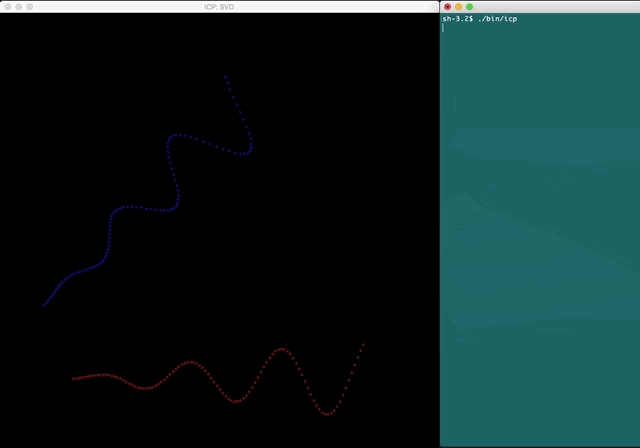

# Robotics C++
Simple collection of C++ codes concerning robotics (mainly autonomous and mobile robotics algorithms) [WORK IN PROGRESS].

## Requirements

- CMake
- OpenCV
- Eigen (Get Eigen >= 3.3.7 and put Eigen headers folder in usr/local/include)

## Build

```
mkdir build
cd build
cmake ../
make -j 8
```

## Algorithms
### Planning
#### RRT

RRT: path found


RRT: path not found


### Localization
### SLAM
### Other
#### ICP

ICP (SVD) - 2D


